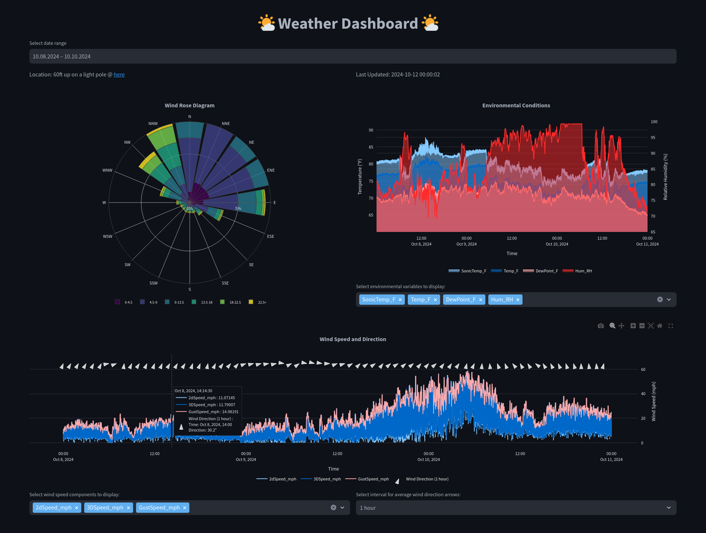
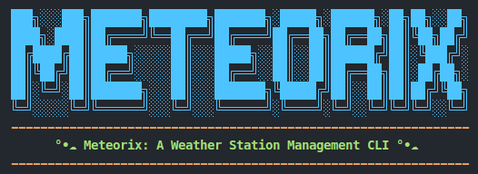

<div align="center">
  
  <h1 align="center">Weather Dashboard</h1>
</div>

This project is a comprehensive weather data analysis system that combines a **Streamlit web dashboard** for visualization, a **CLI tool (Meteorix)** for data management, and a **Discord bot** for remote CLI operations. It focuses on analyzing [Hurricane Milton](https://en.wikipedia.org/wiki/Hurricane_Milton) wind patterns and provides interactive tools across multiple interfaces.

<div align="center">
  
  
</div>

## Web App Operations

### Setup Instructions

1. **Create a new [`conda`](https://github.com/conda-forge/miniforge) environment:**
   ```bash
   conda create -n tmp python=3.12 -y
   ```

2. **Activate the conda environment:**
   ```bash
   conda activate tmp
   ```

3. **Install [`uv`](https://docs.astral.sh/uv/) first:**
   ```bash
   pip install uv
   ```

4. **Install the required packages:**
   ```bash
   uv pip install -r requirements.txt
   ```

5. **Create a `.streamlit/secrets.toml` file:**
   ```bash
   touch .streamlit/secrets.toml
   ```

6. **Add MongoDB URI to `secrets.toml`:**
   ```toml
   [mongo]
   uri = "mongodb+srv://<usr>:<pwd>@<xxxxxx.mongodb.net>/?retryWrites=true&w=majority&appName=Cluster0"
   ```

### Running the Web App
```bash
streamlit run src/app.py
```

## CLI Operations

### Setup Instructions

#### Option 1: Direct Python Command

Simply run the CLI tool directly with Python:
```bash
python src/data/data_cli.py --help
```

#### Option 2: Create CLI Alias (Optional)

For convenience, you can set up an alias named `meteorix`:

1. **Add Project Root to PYTHONPATH:**
   ```bash
   # Get your project root path
   cd /path/to/weather-dashboard
   export PYTHONPATH="$(pwd):$PYTHONPATH"
   ```

2. **Create CLI Alias:**
   ```bash
   # Create alias for the CLI tool
   alias meteorix="python src/data/data_cli.py"
   ```

3. **Make Changes Permanent:**
   Add these lines to your shell configuration file (`~/.bashrc` or `~/.zshrc`):
   ```bash
   export PYTHONPATH="/absolute/path/to/weather-dashboard:$PYTHONPATH"
   alias meteorix="python src/data/data_cli.py"
   ```

4. **Apply Changes:**
   Either:
   - Restart your terminal, or
   - Run: `source ~/.bashrc` (or `source ~/.zshrc`)

5. **Available Commands:**
   The following commands work with either method (replace `meteorix` with `python src/data/data_cli.py` if not using the alias):
   ```bash
   meteorix --help
   ```

### Basic Usage
```bash
# Show whoami
meteorix who

# Show available date range and file statistics
meteorix info

# Upload data for a specific date
meteorix upload 2024_03_20

# Show first/last 5 rows of data
meteorix head 2024_03_20
meteorix tail 2024_03_20
```

## Discord Bot Operations

### Setup Instructions

1. **Add Bot Token to `secrets.toml`:**
   ```toml
   [bot_token]
   token = "YOUR_BOT_TOKEN"

   [channel_id]
   id = "YOUR_CHANNEL_ID"
   ```

2. **Run the Bot:**
   ```bash
   python src/meteorix.py
   ```

### Basic Usage

1. **Mention Commands:**
   ```
   @meteorix help           # Show all commands
   @meteorix info          # Show available date range
   @meteorix head          # Show earliest timestamp
   @meteorix tail          # Show latest timestamp
   ```

2. **Slash Commands:**
   ```
   /info                 # Show available date range
   /head 2024_03_20     # Show first 5 rows of specific date
   /tail                # Show latest timestamp
   ```

## Project Structure
```
📦weather-dashboard
 ┣ 📂.devcontainer               // Dev container configuration
 ┣ 📂.github                     // GitHub workflows and actions
 ┃ ┗ 📂workflows
 ┃ ┃ ┗ 📄ci_cd.yml
 ┣ 📂.streamlit                  // Streamlit configuration files
 ┃ ┣ 📄config.toml                  // App configuration
 ┃ ┗ 📄secrets.toml                 // Secrets configuration
 ┣ 📂lib                         // Library and documentation files
 ┃ ┣ 📂fig                          // Plots and images
 ┃ ┃ ┣ 📂eda
 ┃ ┃ ┣ 📂ml
 ┃ ┃ ┣ 📂pca
 ┃ ┃ ┗ 📄banner.png
 ┃ ┣ 📄project_instructions.pdf
 ┃ ┣ 📄project_proposal.md
 ┃ ┗ 📄project_report.md
 ┣ 📂src                         // Source code files
 ┃ ┣ 📂components                   // Dashboard components
 ┃ ┣ 📂data                         // Data analysis and CLI scripts
 ┃ ┣ 📄app.py                       // Web app file
 ┃ ┗ 📄meteorix.py                  // Discord bot file
 ┣ 📄.gitignore
 ┣ 📄LICENSE
 ┣ 📄README.md
 ┗ 📄requirements.txt            // Python dependencies
```