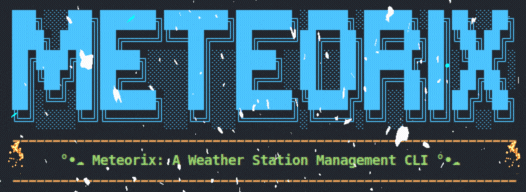
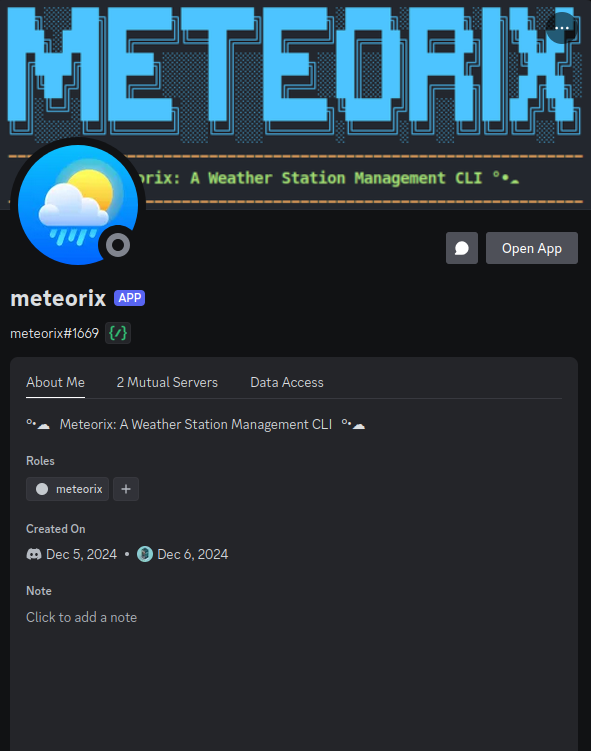

<div align="center">
  
  <h1 align="center">Weather Dashboard</h1>
</div>

This project is a comprehensive weather data analysis system that combines a [Streamlit web dashboard](#web-app-operations) for visualization, a [CLI tool (Meteorix)](#cli-operations) for data management, and a [Discord bot](#discord-bot-operations) for remote CLI operations. It focuses on analyzing [Hurricane Milton](https://en.wikipedia.org/wiki/Hurricane_Milton) wind patterns and provides interactive tools across multiple interfaces.


<div align='center'>
  <h2>Table of Contents</h2>
</div>

<ol>
  <li><a href="#setup-instructions">Setup Instructions</a></li>
  <li><a href="#development-setup">Development Setup</a></li>
  <li><a href="#web-app-operations">Web App Operations</a></li>
  <li><a href="#cli-operations">CLI Operations</a></li>
  <li><a href="#discord-bot-operations">Discord Bot Operations</a></li>
  <li><a href="#project-structure">Project Structure</a></li>
</ol>


<div align="center">
  <h2>Setup Instructions</h2>
</div>

1. **Clone the repository and navigate to project folder:**
   ```bash
   git clone https://github.com/Sang-Buster/weather-dashboard
   cd weather-dashboard
   ```

2. **Install uv first:**
   ```bash
   # macOS/Linux
   curl -LsSf https://astral.sh/uv/install.sh | sh
   ```

   ```bash
   # Windows
   powershell -c "irm https://astral.sh/uv/install.ps1 | iex"
   ```

3. **Create a virtual environment at `/weather-dashboard/.venv/`:**
   ```bash
   uv venv --python 3.12.1
   ```

4. **Activate the virtual environment:**
   ```bash
   # macOS/Linux
   source .venv/bin/activate
   ```

   ```bash
   # Windows
   .venv\Scripts\activate
   ```

5. **Install the required packages:**
   ```bash
   uv pip install -r requirements.txt
   ```


<div align="center">
  <h2>Development Setup</h2>
</div>

1. **Install pre-commit:**
   ```bash
   uv pip install pre-commit
   ```
   Pre-commit helps maintain code quality by running automated checks before commits are made.

2. **Install git hooks:**
   ```bash
   pre-commit install --hook-type commit-msg --hook-type pre-commit --hook-type pre-push

   # it should output something like below:
   # pre-commit installed at .git/hooks/commit-msg
   # pre-commit installed at .git/hooks/pre-commit
   # pre-commit installed at .git/hooks/pre-push
   ```

   These hooks perform different checks at various stages:
   - `commit-msg`: Ensures commit messages follow the conventional format
   - `pre-commit`: Runs Ruff linting and formatting checks before each commit
   - `pre-push`: Performs final validation before pushing to remote

3. **Create a `.streamlit/secrets.toml` file:**
   ```bash
   touch .streamlit/secrets.toml
   ```

4. **Add MongoDB URI to `secrets.toml`:**
   ```toml
   [mongo]
   uri = "mongodb+srv://<usr>:<pwd>@<xxxxxx.mongodb.net>/?retryWrites=true&w=majority&appName=Cluster0"
   ```
   The MongoDB collections should mirror the structure of the CSV files in `src/data/YYYY_MM_DD_weather_station_data.csv` folder, with each document containing timestamp and sensor readings.

<div align="center">
  <h2>Web App Operations</h2>
  
</div>

Running the web app locally is as simple as running the following command:

```bash
streamlit run src/app.py
```


<div align="center">
  <h2>CLI Operations</h2>
  
</div>

### Setup Instructions

#### Option 1: Direct Python Command

Simply run the CLI tool directly with Python:
```bash
python src/cli.py --help
```

#### Option 2: Create CLI Alias (Optional)

For convenience, you can set up an alias named `meteorix`:

1. **Add Project Root to PYTHONPATH:**
   ```bash
   # Get your project root path
   cd /path/to/weather-dashboard
   export PYTHONPATH="$(pwd):$PYTHONPATH"
   ```

2. **Create CLI Alias:**
   ```bash
   # Create alias for the CLI tool
   alias meteorix="python src/cli.py"
   ```

3. **Make Changes Permanent:**
   Add these lines to your shell configuration file (`~/.bashrc` or `~/.zshrc`):
   ```bash
   REPO_DIR="/path/to/weather-dashboard"
   PYTHON_PATH="$REPO_DIR/.venv/bin/python"
   CLI_PATH="$REPO_DIR/src/cli.py"
   alias meteorix="$PYTHON_PATH $CLI_PATH"
   ```

   To get autocomplete working, you need to add the following to your shell configuration file (`~/.bashrc` or `~/.zshrc`), this is the fastest way to manually adding cli commands vs using `register-python-argcomplete`:
   ```bash
   # Add these lines to your `~/.bashrc`:
   # Meteorix CLI configuration
   export REPO_DIR="/path/to/weather-dashboard"
   export PYTHON_PATH="$REPO_DIR/.venv/bin/python"
   export CLI_PATH="$REPO_DIR/src/cli.py"

   # Create function wrapper for the CLI
   function meteorix {
      $PYTHON_PATH $CLI_PATH "$@"
   }

   # Pure bash completion - no Python involved
   function _meteorix_complete {
      local cur=${COMP_WORDS[COMP_CWORD]}
      local commands="upload delete check head tail info spit plot freq ifconfig top monitor chat eda ml who -h --help"
      
      if [ $COMP_CWORD -eq 1 ]; then
         COMPREPLY=($(compgen -W "$commands" -- "$cur"))
      fi
   }

   # Register completion
   complete -F _meteorix_complete meteorix
   ```

   or

   ```zsh
   # Add these lines to your `~/.zshrc`:
   # Meteorix CLI configuration
   export REPO_DIR="/path/to/weather-dashboard"
   export PYTHON_PATH="$REPO_DIR/.venv/bin/python"
   export CLI_PATH="$REPO_DIR/src/cli.py"

   # Create function wrapper for the CLI
   function meteorix {
      $PYTHON_PATH $CLI_PATH "$@"
   }

   # Zsh completion
   function _meteorix {
      local commands="upload delete check head tail info spit plot freq ifconfig top monitor eda ml who -h --help"
      _arguments "1: :($commands)"
   }

   # Register completion
   compdef _meteorix meteorix
   ```

4. **Apply Changes:**
   Either:
   - Restart your terminal, or
   - Run: `source ~/.bashrc` (or `source ~/.zshrc`)

5. **Show Available Commands:**
   ```bash
   meteorix --help
   ```

### Basic Usage
The following commands work with either method (replace `meteorix` with `python src/cli.py` if not using the alias):

```bash
# Show whoami
meteorix who

# Show available date range and file statistics
meteorix info

# Upload data for a specific date
meteorix upload 2024_03_20

# Show first/last 5 rows of data
meteorix head 2024_03_20
meteorix tail 2024_03_20
```


<div align="center">
  <h2>Discord Bot Operations</h2>
  
</div>

### Setup Instructions

1. **Create a Discord Bot Application:**
   1. Log into the [Discord Developer Portal](https://discord.com/developers/applications)
   2. Click "New Application" and give it a name
   3. Go to the "Bot" tab and click "Add Bot"
   4. Under the bot's username, click "Copy" to copy your bot's token
   5. In the Bot tab, enable the following Privileged Gateway Intents:
      - `Message Content Intent`
      - `Server Members Intent`
      - `Presence Intent`
   6. Make sure that **Public Bot** is enabled if you want others to invite your bot
   7. Disable **Require OAuth2 Code Grant** unless you specifically need it
   
   > **Warning**: Never share your bot token! If exposed, immediately regenerate it in the Developer Portal.

2. **Invite the Bot to Your Server:**
   1. Go to the "OAuth2 > URL Generator" tab
   2. Under "Scopes", select:
      - `bot`
      - `applications.commands`
      - `messages.read`
   3. Under "Bot Permissions", select:
      - `Read Messages/View Channels`
      - `Send Messages`
      - `Send Messages in Threads`
      - `Embed Links`
      - `Attach Files`
      - `Read Message History`
      - `Add Reactions`
      - `Use Slash Commands`
   4. Copy the generated URL and open it in a browser to invite the bot

3. **Add Bot Token to `.streamlit/secrets.toml`:**
   ```toml
   [bot_token]
   token = "YOUR_BOT_TOKEN"

   [channel_id]
   channel_1_id = "YOUR_CHANNEL_ID_1"
   channel_2_id = "YOUR_CHANNEL_ID_2"
   # add more channels as needed
   ```

   You can start the bot immediately using `python src/meteorix.py`. However, to keep it running continuously, it's recommended to set up a **systemd service**:

4. **Create Systemd Service File:**
   ```bash
   sudo nano /etc/systemd/system/meteorix-bot.service
   ```

5. **Add the following configuration** (adjust paths and username):
   ```ini
   [Unit]
   Description=Meteorix Discord Bot
   After=network.target

   [Service]
   Type=simple
   User=YOUR_USERNAME
   WorkingDirectory=/path/to/weather-dashboard
   Environment="PATH=/path/to/weather-dashboard/.venv/bin"
   ExecStart=/path/to/weather-dashboard/.venv/bin/python /path/to/weather-dashboard/src/meteorix.py
   Restart=always
   RestartSec=10

   [Install]
   WantedBy=multi-user.target
   ```

6. **Enable and Start the Service:**
   ```bash
   # Enable the service to start on boot
   sudo systemctl enable meteorix-bot

   # Start the service
   sudo systemctl start meteorix-bot

   # Check service status
   sudo systemctl status meteorix-bot
   ```

7. **Common Service Commands:**
   ```bash
   # Stop the bot
   sudo systemctl stop meteorix-bot

   # Restart the bot (after code changes)
   sudo systemctl restart meteorix-bot

   # View live logs
   sudo journalctl -u meteorix-bot -f
   ```

### Basic Usage

1. **Mention Commands:**
   ```
   @meteorix help          # Show all commands
   @meteorix info          # Show available date range
   @meteorix head          # Show earliest timestamp
   @meteorix tail          # Show latest timestamp
   ```

2. **Slash Commands:**
   ```
   /help                # Show all commands
   /info                # Show available date range
   /head 2024_03_20     # Show first 5 rows of specific date
   /tail                # Show latest timestamp
   ```


<div align='center'>
   <h2>Project Structure</h2>
</div>

```
📦weather-dashboard
 ┣ 📂.devcontainer               // Dev container configuration
 ┣ 📂.github                     // GitHub workflows and actions
 ┣ 📂.streamlit                  // Streamlit configuration files
 ┃ ┣ 📄config.toml                  // App configuration
 ┃ ┗ 📄secrets.toml                 // Secrets configuration
 ┣ 📂lib                         // Library and documentation files
 ┃ ┣ 📂fig                          // Plots and images
 ┃ ┣ 📄project_instructions.pdf
 ┃ ┣ 📄project_presentation.pdf
 ┃ ┣ 📄project_proposal.md
 ┃ ┗ 📄project_report.md
 ┣ 📂src                         // Source code files
 ┃ ┣ 📂cli_components               // CLI components
 ┃ ┣ 📂web_components               // Dashboard components
 ┃ ┣ 📂data                         // Data and analysis scripts
 ┃ ┣ 📄app.py                       // Web app main script
 ┃ ┣ 📄cli.py                       // CLI tool main script
 ┃ ┗ 📄meteorix.py                  // Discord bot script
 ┣ 📄.gitignore
 ┣ 📄.pre-commit-config.yaml
 ┣ 📄.pre-commit_msg_template.py
 ┣ 📄LICENSE
 ┣ 📄README.md
 ┗ 📄requirements.txt            // Python dependencies
```
